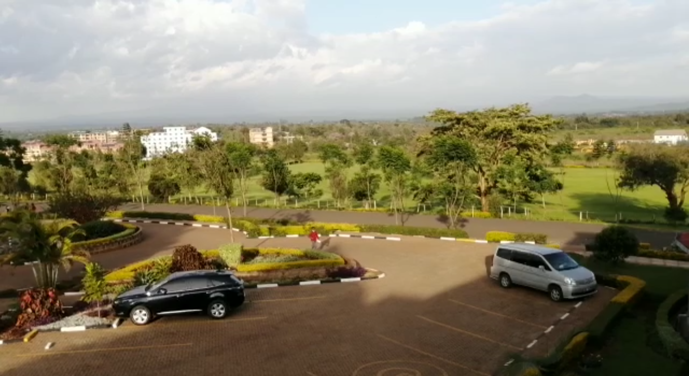
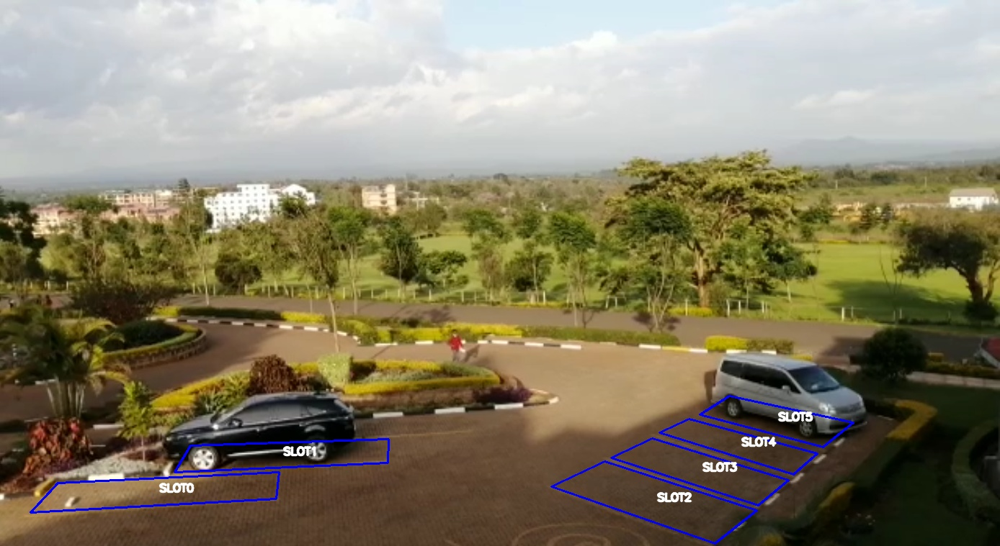
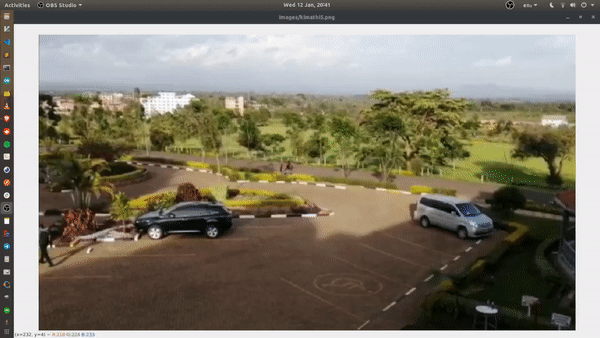

<center>
    <h1><b> Parking Management Hardware System </b></h1>
</center>

## Description
The goal of the system is to automate paking management, the system should use the Raspberry Pi Camera to stream the video of the parking lot and should automatically detect whenever a parking space is available or occupied. Occupancy timing is carried out for all occupied slots for billing purposes and all this occupancy data is then sent to the server(socket connection or api interface).

| </img> 	| </img> 	|
|:----------------------------------------------:	|:----------------------------------------------:	|
## Demo
</img>
## Hardware
1. Raspberry Pi 3 model B
2. Raspberry Pi camera v2 8MP

## Prerequisites
- Python 3
- opencv

### To Do List

<s>  [ ] Automatic slot detection</s>

- [x] Slot drawing with mouse callback functions
- [x] Vehicle occupancy Detection
- [ ] Socket/API server communication
- [x] Praying that this thing works
- [ ] Add argparser cli interface to switch between images and video streams
## Running on the pi or locally
### clone the repository and navigate to the project directory
```bash
git clone git@github.com:DanNduati/Parking-Management-System.git
cd parking_management_system/
```
### Create a python virtual environment activate it
```bash
python3 -m venv venv
source venv/bin/activate
```
### Run the script
```bash
python main.py
```

## License
[](LICENSE)